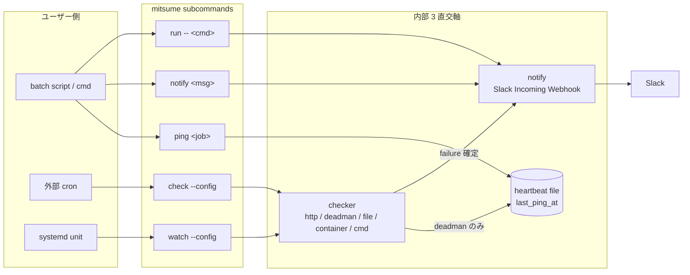

# Architecture

mitsume の設計思想と、そこから展開した内部構造を説明する。「なぜこの分け方にしたか」「何を意図的に外したか」に焦点を絞る。運用パターンごとの設定例は [recipes.md](recipes.md)、機能の使い方は [getting-started.md](getting-started.md) や各 reference doc を参照。

読者としては contributor と、詳しく仕組みを知りたい user を想定する。

## 何を解こうとしているか

「動いてるはずの何かが動いていなかった」に気付きたい、規模の小さな運用が対象。次の 4 要素が同時に成り立つ範囲でしか mitsume は選ばれない。

- 監視対象は host 数個、check 数十個の桁
- 通知先は Slack 1 channel あれば足りる
- 時系列ダッシュボードや SLO 計算は要らない
- 「監視スタックを組む工数」を払いたくない

Datadog / New Relic / Grafana / Prometheus を入れる規模の運用は mitsume の対象外。逆にこれらより下の層 — 個人の homelab、社内 batch サーバー、家庭サーバー — の空白を埋める。

## 設計優先順

矛盾する選択に当たったら、上から順に適用して切る。

1. **single binary、依存ゼロ**: Dockerfile に `ADD` するだけで使える形を維持する。専用の container や web service を要求しない。
2. **1 行差し込みで動く**: 既存 script の末尾に `mitsume notify` を入れる、または `mitsume run -- <cmd>` で wrap するだけで通知が飛ぶ形を維持する。設定 JSON 無しで動くモード (`ping` / `notify` / `run`) を first-class に持ち、`watch` の稼働を要件としない。
3. **気づきの欠落も過剰通知も避ける**: 取りこぼしを許さず、かつリマインドで通知量を膨らませる方向にも行かない。失敗確信は短 retry burst で取る。
4. **機能を絞る**: 必要なものだけ入れる。「これくらい入れても安いコストで」は不採用のデフォルトとする。

秘密情報 (Slack Webhook URL 等) を CLI 引数で値渡ししない、これは優先順とは独立した絶対条件。env 経由 (`MITSUME_*` の既知名か `--*-env <name>` で env 変数名) のみサポートする。`ps aux` / `/proc/<pid>/cmdline` から同一 host の他ユーザーに漏れる経路を塞ぐため。

## 3 直交軸 — checker / notify / heartbeat file

内部の要素は 3 軸に分けて、互いに詳細を持ち込まない。

| 軸 | 役割 | 状態 | 詳細 |
|---|---|---|---|
| **checker** | 監視対象 1 単位を評価し、成功 / 失敗を返す | 持たない (評価サイクル内で完結) | [checkers.md](checkers.md) |
| **notify** | Slack に payload を送る | 持たない | [notify.md](notify.md) |
| **heartbeat file** | per-`job` の `last_ping_at` を保持する JSON text file | 持つ (唯一の永続状態) | [heartbeat.md](heartbeat.md) |

3 軸の唯一の接点は dead-man's switch checker。`ping` サブコマンドが heartbeat file に `last_ping_at` を write し、`check` / `watch` の deadman 評価がそれを read only で参照する。それ以外に heartbeat file を触るサブコマンドは無い。

軸間の情報の流れは次の 4 つに限る。

| 流れ | 発生元 | 発生先 | 用途 |
|---|---|---|---|
| `last_ping_at` の write | `ping` | heartbeat file | dead-man's switch のリセット |
| `last_ping_at` の read | deadman checker | heartbeat file | 経過時間の評価 |
| failure payload の送信 | checker (評価) | notify | 失敗確定時の 1 通 |
| 明示 payload の送信 | `notify` / `run` | notify | ユーザー起点の 1 通 |

なぜこの分け方か。checker と notify を state-less にし、heartbeat file を「`ping` の到来時刻専用」に絞ることで、以下が自然に成立する。

- **再起動不変性**: `watch` プロセスを再起動しても、判定結果は heartbeat file の内容だけから一意に決まる。前回 alert 時刻や `consecutive_failures` を保存していないので、再起動で二重通知になったり、逆に取りこぼしたりする経路が構造的に存在しない。
- **並行実行の race を狭められる**: 状態を持つのは heartbeat file だけなので、atomic rename (`os.Rename`) で race を回避する対象が 1 個で済む。
- **各軸のテストが独立にできる**: notify を止めても checker のロジックだけテストできる。heartbeat file を fake しても deadman 評価をテストできる。

能動 checker (`http` / `file` / `cmd` / `container`) の状態や通知履歴は heartbeat file には書かない。書くと SQLite に相当する schema migration の面倒を持ち込むことになるし、「`ping` の到来時刻」以外を混ぜると `cat` / `jq` で読める安心感が失われる。

## サブコマンドの責務

サブコマンドは 5 つ。3 直交軸のどれをどう組み合わせて使うかで役割が決まる。

| サブコマンド | 責務 | 通知 | heartbeat file | 設定 JSON |
|---|---|---|---|---|
| `mitsume ping [<job>]` | dead-man's switch のリセット | 出さない | write | 無くても動く |
| `mitsume notify <msg>` | 単発 Slack 通知 | 即時 1 通 | 触らない | 無くても動く |
| `mitsume check [--config]` | 全 check を 1 回評価して exit (外部 cron 用) | 失敗ごとに 1 通 | deadman を含むときのみ read | 必須 |
| `mitsume watch [--config]` | 常駐して `interval` ごとに評価 (systemd 用) | 失敗ごとに 1 通 | deadman を含むときのみ read | 必須 |
| `mitsume run -- <cmd>` | 子プロセスの supervisor | 子の終了で 1 通 | 触らない | 無くても動く |

通知が Slack に出るのは 2 系統のみ。

1. **明示イベント**: `notify` の直接呼び出し、`run` の内部呼び出し。
2. **能動検出の failure 確定**: `check` / `watch` の評価で `confirm` burst を通ったとき。

`ping` は heartbeat file の更新に専念し、通知は出さない。`run` は `notify` のみ呼び、`ping` 相当の処理は呼ばない。dead-man's switch と連動させるときは shell で `mitsume run -- <cmd> && mitsume ping <job>` の形で組む。

「設定 JSON 不要モード」(`ping` / `notify` / `run`) は最重要 UX として維持する。既存 script / cron / Dockerfile に 1 行差し込むだけで通知が飛ぶ、が拡張のときにも壊れないようにする。

共通 flag `--dry-run` は全サブコマンドで効き、Slack への送信抑止 + stderr への payload 出力 + heartbeat file 書き換え抑止をまとめて行う。`run --dry-run` の場合、子プロセスは実際に走らせて通知だけを止める (子の副作用ごと止めると `run` の動作検証にならないため)。

## 失敗確信モデル

失敗確信は「短 retry burst」で取る。1 回の failure を検知したら `confirm.interval` × `confirm.checks` 回だけ短い間隔で連続確認し、全滅で failure を確定する。

なぜ「通常 `interval` を N 回まわす」形にしなかったか。`interval` は過剰通知の抑制を担う値で、1h 以上を推奨する。ここで N 回まわす debounce を組むと、「本当に落ちてる状態が N × 1h = 数時間気付かれない」ことになる。逆に `interval` を短くすると過剰通知の抑制が壊れる。時間スケールが 2 種類要ることが構造的に決まる。

`interval` (通常サイクル、1h 以上) と `confirm.interval` (短 retry の粒度、default 30s) の 2 軸に分けることで、両方を並立させる。1 評価サイクル内で burst が完結してから次の `interval` を待つ形にすることで、状態遷移も単純になる (burst 完了 → 通常 interval の 2 状態のみ)。

field 定義、default 値、時間軸例は [configuration.md](configuration.md#confirm-失敗確信モデル) と [checkers.md](checkers.md#confirm) を参照。

## 通知トリガー

通知トリガーは「失敗確定のたびに 1 通、debounce なし」に固定する。設定 surface を持たない。

なぜ debounce なし・recovery なし・リマインドなしか。

- **debounce**: 前回状態を持たない設計にしたので、そもそも debounce する材料がない。debounce を入れると `consecutive_failures` などの永続状態が要り、heartbeat file の純度が壊れる。過剰通知の抑制は `interval` の値 (1h 以上推奨) で行う。
- **recovery 通知**: 「失敗のたび 1 通」だけを守ると、`always` 相当のリマインドが自然に成立する。ok に戻ったことは「次の失敗通知が来ない」で判る。recovery 通知を出すには前回状態が要るので、debounce と同じ理由で持ち込まない。
- **リマインド**: `always` / `backoff` の再送タイマーを持たない。「失敗のたび 1 通」で `always` 相当は成立している。

通知先は Slack 単一に固定する。`notifiers` named map / `checks[].notify` 配列 / 並列 fan-out は持たない。channel 分離が必要なら Webhook を分けて config を分け、systemd unit を複数立てる。

秘密情報 (webhook URL) は env 経由 (`_env` サフィックス) のみで受け取り、JSON への直接記述は許さない。詳細は [configuration.md](configuration.md#秘密情報-env-経由のみ) を参照。

通知失敗 (Slack 5xx / network unreachable 等) は checker の評価結果を変えない。checker は成功 / 失敗を確定させたら仕事を終える。通知失敗のログは stderr に出すが、heartbeat file には書かない。

## 自身の死活

死活監視ツールが自分自身の死を確実に通知するのは構造的に不可能。best-effort としてこれだけ入れる。

- SIGTERM / SIGINT 受信時に defer で 1 発 `notify` を投げる
- panic 時は recover してから `notify` を投げ、re-panic する (Go runtime に握らせて stack trace を stderr に出し、exit code は `2` で終わる)

これら以外の生存保証は OS 側の仕組みに委ねる。systemd unit なら `Restart=on-failure`、Docker container なら restart policy を使う。mitsume 側で自身を能動 ping する機能や、外部 dead-man's switch (Healthchecks.io ping 等) との連携は持たない。

通知が飛ばずに死ぬケース (SIGKILL / OS 停止 / 電源断) が構造的に存在することを、運用者に対して spec / recipes 側で明示する ([recipes.md](recipes.md#http-endpoint--file--container-を常駐で見張りたい) の `OnFailure=` 二段構え、[notify.md](notify.md) の「自身の死活」節など)。

shutdown シーケンス中に新しい checker 評価は始めない。走行中の評価は結果を破棄する。

`run` サブコマンドの子プロセス側の生存は、`run` 自身が supervisor として `SIGCHLD` で即時検知する。外部からの `pgrep` / pid_file polling は不要。

## container checker の実装方針

`container` checker は Docker SDK に依存しない。Docker Engine API の `/containers/<container>/json` を unix socket 経由で `net.Dial("unix", ...)` + `net/http` で直接叩く。

Docker SDK を入れないのは、single binary + `CGO_ENABLED=0` を維持したいのと、SDK は API 全域を包括する巨大なモジュールで mitsume が使うのは 1 endpoint だけ、というバランスから。unix socket + HTTP GET だけなら数百行に収まる。

リモート host の container 監視は scope 外。「監視スタックを組む工数を払いたくない」対象は、監視対象と同一 host に `mitsume watch` を置く運用パターンで足りる。TCP 越しの Docker Remote API を触る仕組みは持たない。

socket 探索順、API endpoint 詳細、compose 命名規則は [checkers.md](checkers.md#container-checker) を参照。

## 意図的に外したもの (non-goals)

仕様として持たないものを並べる。要望に応じて足すのではなく、「小さな運用の死活監視」から外れた時点で別のツールを使う。

- 通知先の複数化 / channel 別 routing (Slack 1 本に固定)
- 通知の rich な block kit / severity レベル / arbitrary tags
- 前回状態を持つ debounce / recovery / リマインド
- 時系列メトリクス、SLO 計算、ダッシュボード
- リモート host の container 監視
- 監視対象の pull / push の切り替え、web UI、REST API
- `HEALTHCHECK` 連動 (`.State.Health.Status`) 、`healthy` 判定
- 実行時の config reload (SIGHUP handling)

一つ足すたびに「設定 JSON 不要モード」と「1 行差し込みで動く」の 2 つが壊れやすくなる。優先順は保つ。

## 関連

- [getting-started.md](getting-started.md) — 動かして雰囲気を掴む
- [cli.md](cli.md) — サブコマンドの実引数
- [configuration.md](configuration.md) — 設定 JSON schema
- [checkers.md](checkers.md) — 5 checker の詳細
- [notify.md](notify.md) — Slack payload
- [heartbeat.md](heartbeat.md) — heartbeat file の schema
- [tests/README.md](../tests/README.md) — テスト方針
