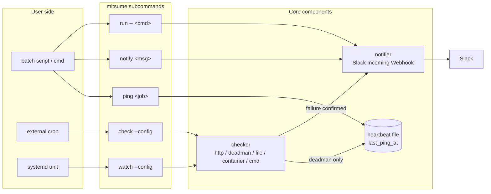

# Architecture

mitsume の設計思想と、そこから展開した内部構造を説明する。「なぜこの分け方にしたか」「何を意図的に外したか」に焦点を絞る。運用パターンごとの設定例は [recipes.md](recipes.md)、機能の使い方は [getting-started.md](getting-started.md) を参照する。

想定読者は contributor と、内部の仕組みを踏み込んで知りたい user である。

## スコープ

mitsume の対象は「動いているはずのものが動いていないことに気づきたい」小規模運用である。次の 4 条件が同時に成り立つ範囲でのみ mitsume を選ぶ。

- 監視対象は host 数個、check 数十個の桁である。
- 通知先は Slack 1 channel で足りる。
- 時系列ダッシュボードや SLO 計算は不要である。
- 監視スタックを組む工数は払わない。

Datadog / New Relic / Grafana / Prometheus を導入する規模の運用は mitsume の対象外である。これらより下の層 — 個人の homelab、社内 batch サーバー、家庭サーバー — の空白を埋める。

## 設計原則

矛盾する選択に当たったとき、上から順に適用して判断する。

1. **Single binary, no dependencies.** Dockerfile に `ADD` するだけで使える形を維持する。専用の container や web service を要求しない。
2. **Zero-config quickstart.** 既存 script の末尾に `mitsume notify` を挿入する、または `mitsume run -- <cmd>` で wrap するだけで通知が送信される形を維持する。設定 JSON なしで動く subcommand (通知に関与する `ping` / `notify` / `run` の 3 個と、identification のみの `version` を加えた 4 個) を first-class に持ち、`watch` の稼働を前提としない。
3. **No missed alerts, no notification spam.** 取りこぼしを許さず、かつリマインドで通知量を膨らませる方向にも進まない。失敗確定は [confirm burst](#用語) で取る。
4. **Feature minimalism.** 必要なものだけを持つ。「これくらい入れても安いコストで」は不採用の default とする。

秘密情報 (Slack Webhook URL など) を CLI 引数で値渡ししない。これは上記優先順とは独立した絶対条件であり、詳細は [Security invariants](#security-invariants) を参照する。

## 用語

以下の用語は本 doc を SSOT とし、他 doc は初出時に本節へリンクする。

| 用語 | 定義 |
|---|---|
| **check** | 設定 JSON の `checks[]` の 1 エントリ。1 つの具体的な監視設定を指す。 |
| **checker** | `type` ごとの評価ロジック実装 (`http` / `deadman` / `file` / `container` / `cmd`)。 |
| **active checker** | 外部を能動的に評価する 4 種の checker (`http` / `file` / `container` / `cmd`)。 |
| **dead-man's switch** | ping の到来間隔で失敗を判定する反転監視の総称。 |
| **`deadman` checker** | dead-man's switch の checker 実装 (`type: "deadman"`)。 |
| **job** | dead-man's switch における per-target 識別子。heartbeat file 内の key と一致する。 |
| **confirm burst** | failure 検知後に短い間隔で連続確認する一連の動作。default は合計 3 回 (`confirm.checks: 3`)、追加確認の間隔 30s (`confirm.interval: 30s`)。詳細は [Failure confirmation](#failure-confirmation) を参照。 |
| **heartbeat file** | `mitsume.heartbeat.json`。dead-man's switch のための唯一の永続状態。 |
| **notifier** | 内部で通知を送信する component。 |
| **`notify`** | 単発通知を送信する subcommand。表記は常に backtick で囲む。 |
| **設定 JSON** | 設定ファイル本体 (`mitsume.json` など)。 |
| **subcommand** | mitsume の CLI 動作単位 (`ping` / `notify` / `check` / `watch` / `run` / `version`)。 |

## Core components

mitsume の内部は 3 component に分かれる。互いに詳細を持ち込まない。

| Component | 役割 | 永続状態 | 詳細 |
|---|---|---|---|
| **checker** | check 1 単位を評価し、成功または失敗を返す。 | 持たない (評価サイクル内で完結する)。 | [checkers.md](checkers.md) |
| **notifier** | Slack Incoming Webhook に payload を送信する。 | 持たない。 | [notify.md](notify.md) |
| **heartbeat file** | per-job の `last_ping_at` を保持する JSON text file。 | 持つ (mitsume の唯一の永続状態)。 | [heartbeat.md](heartbeat.md) |

heartbeat file が他 component と接続する経路は dead-man's switch のみである。`ping` subcommand が heartbeat file に `last_ping_at` を書き込み、`check` / `watch` の `deadman` 評価はそれを read-only で参照する。それ以外に heartbeat file を触る subcommand は存在しない。checker と notifier の接続 (failure payload の送信) はこの経路と独立である。

component 境界を跨ぐ情報の流れは次の 4 経路に限る。「発生元」列には subcommand と checker 実装が混在するが、それぞれは対応する component (subcommand は「サブコマンドの責務」節、checker は checker component) の入口として動く。

| Flow | 発生元 | 発生先 | 用途 |
|---|---|---|---|
| `last_ping_at` の write | `ping` | heartbeat file | dead-man's switch のリセット |
| `last_ping_at` の read | `deadman` checker | heartbeat file | 経過時間の評価 |
| failure payload の送信 | checker (評価結果) | notifier | 失敗確定時の 1 通 |
| 明示 payload の送信 | `notify` / `run` | notifier | ユーザー起点の 1 通 |

この分離により以下が成立する。

- **Restart invariance.** `watch` を再起動しても判定は heartbeat file の内容だけから一意に決まる。前回 alert 時刻や `consecutive_failures` を保存しないため、再起動で二重通知や取りこぼしを起こす経路が構造的に存在しない。
- **Localized race.** 永続状態は heartbeat file だけであり、同一 filesystem 上の atomic rename で race を回避する対象が 1 個で済む。
- **Independent testing.** notifier を止めても checker のロジックを単体でテストできる。heartbeat file を fake しても `deadman` 評価をテストできる。

active checker (`http` / `file` / `cmd` / `container`) の状態や通知履歴は heartbeat file に書き込まない。「`ping` の到来時刻」以外を混ぜると `cat` / `jq` で読める可読性が失われ、schema migration の必要も発生する。

## サブコマンドの責務

mitsume は 6 個の subcommand を持つ。3 component をどう組み合わせるかで役割が決まる。`version` は監視 logic には関与しないが、release binary を識別するために別枠で持つ。

| Subcommand | 役割 | 通知 | heartbeat file | 設定 JSON |
|---|---|---|---|---|
| `mitsume ping [<job>]` | dead-man's switch のリセット | 出さない | write | 無くても動く |
| `mitsume notify <msg>` | 単発 Slack 通知 | 即時 1 通 | 触らない | 無くても動く |
| `mitsume check [--config]` | 全 check を 1 回評価して exit (外部 cron 用) | 失敗ごとに 1 通 | `deadman` を含むときのみ read | 必須 |
| `mitsume watch [--config]` | 常駐して `interval` ごとに評価 (systemd 用) | 失敗ごとに 1 通 | `deadman` を含むときのみ read | 必須 |
| `mitsume run -- <cmd>` | 子プロセスの supervisor | 子の終了で 1 通 | 触らない | 無くても動く |
| `mitsume version` | binary の version / commit / build date を表示 | 出さない | 触らない | 触らない |

Slack への通知は次の 2 系統のみで発生する。

1. **Explicit event.** `notify` の直接呼び出し、`run` の内部呼び出し。
2. **Active detection.** `check` / `watch` の評価で confirm burst を通過し、failure が確定したとき。

`ping` は heartbeat file の更新に専念し、通知は出さない。`run` は notifier のみを呼び、`ping` 相当の処理は呼ばない。dead-man's switch と連動させる場合は shell で `mitsume run -- <cmd> && mitsume ping <job>` の形で組み合わせる。`version` は監視ロジックを持たず、identification と bug report 時の照合用に stdout へ出力するのみである ([cli.md § mitsume version](cli.md#mitsume-version))。

「設定 JSON 不要 subcommand」(`ping` / `notify` / `run` / `version`) は最重要 UX として維持する。既存 script / cron / Dockerfile に 1 行差し込むだけで通知が動く形を、機能追加時にも壊さない。

共通 flag `--dry-run` は `ping` / `notify` / `check` / `watch` / `run` で有効であり、Slack への送信抑止、stderr への payload 出力、heartbeat file 書き換えの抑止をまとめて行う (`version` は副作用がないため対象外)。`run --dry-run` の場合、子プロセスは実際に走らせて通知だけを抑止する。子の副作用ごと止めると `run` の動作検証にならないためである。

## Failure confirmation

failure 確定は confirm burst で取る。burst の駆動は `check` / `watch` subcommand が checker を `confirm.checks` 回呼び出す形で行い、checker 自身は 1 回の評価に専念する。初回の failure を検知した後、`confirm.interval` (default `30s`) の間隔で追加 `confirm.checks - 1` 回 (default `checks: 3` の場合は追加 2 回) を評価し、初回を含む合計 `confirm.checks` 回のすべてが failure だった場合に failure を確定して notifier を呼び出す。

時間スケールを 2 種類に分ける理由は次の通りである。`interval` は過剰通知の抑制を担う値であり、1h 以上を推奨する。ここで「N 回まわす debounce」を組むと、失敗が N × 1h 単位で検知されない構造になる。逆に `interval` を短くすると過剰通知の抑制が壊れる。したがって `interval` (通常サイクル) と `confirm.interval` (short retry の粒度、default 30s) を独立に持つ必要がある。

1 評価サイクル内で burst が完結してから次の `interval` を待つ形にすることで、1 サイクル = burst → 通常 interval 待機、の直列 2 段に単純化される。

field 定義、default 値、時間軸の例は [configuration.md § confirm](configuration.md#confirm) と [checkers.md § confirm](checkers.md#confirm) を参照する。

## 通知トリガー

通知トリガーは「failure 確定のたびに 1 通、debounce なし」に固定する。設定 JSON に露出する field は持たない。

- debounce / recovery 通知 / リマインドを持たない理由は [Design decisions](#design-decisions) を参照する。
- 通知先は Slack Incoming Webhook 1 本に固定する。channel を分ける必要がある場合は Webhook を分けて config を分け、systemd unit を複数立てる。
- 秘密情報 (Webhook URL) は env 経由 (`_env` サフィックス) のみで受け取り、JSON への直接記述を許可しない。[configuration.md § 秘密情報](configuration.md#秘密情報) を参照する。
- 通知失敗 (Slack 5xx / network unreachable など) は checker の評価結果を変えない。checker は failure 確定を出した時点で仕事を終える。通知失敗のログは stderr に出すが、heartbeat file には書き込まない。

## 自身の死活

死活監視ツールが自身の死を確実に通知することは構造的に不可能である。best-effort として次のみを保証する。

- SIGTERM / SIGINT 受信時に 1 通の通知を送信してから exit する。
- 予期せぬ fatal error (unrecoverable runtime error) を検知した場合は、best-effort で 1 通の通知を送信してから exit code `2` で異常終了する。error trace は stderr に出力する。

これ以外の生存保証は OS 側の仕組みに委ねる。systemd unit なら `Restart=on-failure`、Docker container なら restart policy を使う。mitsume 側で自身を能動 ping する機能や、外部 dead-man's switch (Healthchecks.io など) との連携は持たない。

通知が送信されずに死ぬケース (SIGKILL / OS 停止 / 電源断) が構造的に存在することを、運用者に対して各 doc で明示する ([recipes.md § 常駐監視](recipes.md#常駐監視) の `OnFailure=` 二段構え、[notify.md § Retry](notify.md#retry) の delivery 保証節を参照する)。

shutdown シーケンス中に新しい checker 評価は開始しない。走行中の評価は結果を破棄する。

`run` subcommand の子プロセスの生存は、`run` 自身が supervisor として `SIGCHLD` で即時検知する。外部からの `pgrep` / pid file polling は不要である。

## Security invariants

以下は spec 上の絶対条件であり、いかなる code path でも維持する。

- **秘密情報を CLI 引数で受け取らない。** env 経由 (`MITSUME_*` の既知名、または `--*-env <name>` で env 変数名を渡す形) のみをサポートする。`ps aux` / `/proc/<pid>/cmdline` から同一 host の他ユーザーに秘密情報が漏れる経路を塞ぐ。
- **秘密情報を log、エラーメッセージ、notifier payload、heartbeat file に書き込まない。** stderr へのログでも webhook URL / token は redact する。
- **heartbeat file は 0600 で作成する。** 同一 host の他ユーザーから `last_ping_at` を書き換えられる経路を塞ぐ。

## Design decisions

Design principles から派生した個別の判断を列挙する。要望に応じて足すのではなく、判断の理由を明示する。

### Debounce, recovery, and reminder are not supported

前回状態を持たない設計を採用したため、debounce する材料が構造的に存在しない。debounce を導入すると `consecutive_failures` などの永続状態が必要になり、heartbeat file の純度が失われる。過剰通知の抑制は `interval` の値 (1h 以上を推奨) で行う。

「failure のたびに 1 通」を守ると、常時通知 (Alertmanager の `repeat_interval` などに相当するリマインド) と同等の挙動が自然に成立する。ok に戻ったことは「次の failure 通知が来ない」ことで判る。recovery 通知を追加するには前回状態が必要となり、同じ理由で持ち込まない。

一定間隔での自動リマインドや exponential backoff での再送タイマーの類も持たない。

### Slack channel is fixed to a single Webhook

`notifiers` named map / `checks[].notify` 配列 / 並列 fan-out は持たない。channel を分ける場合は Webhook を分けて config を分け、systemd unit を複数立てる。

fan-out を導入すると、通知先ごとの retry / rate limit / template を設定 JSON の field として露出させる必要が生じ、設定 JSON の複雑度が跳ね上がる。「Slack 1 本で足りる小規模運用」の scope から外れる。

### Docker SDK is not used

`container` checker は Docker SDK に依存しない。Docker Engine API の `/containers/<container>/json` を UNIX domain socket 経由で直接呼び出す。

Docker SDK を除外する理由は 2 つある。第 1 に、single binary + `CGO_ENABLED=0` を維持したい。第 2 に、SDK は API 全域を包括する巨大なモジュールであり、mitsume が使うのは 1 endpoint だけである。UNIX domain socket + HTTP GET の直接呼び出しなら数百行に収まる。

socket 探索順、API endpoint 詳細、compose 命名規則は [checkers.md § Container checker](checkers.md#container-checker) を参照する。

### SQLite / DB is not used

永続状態は heartbeat file (JSON text) 1 個に絞る。SQLite などの DB を持ち込むと schema migration が発生し、`cat` / `jq` で状態を読める可読性が失われる。「`ping` の到来時刻」以外を保持しない制約でこれを回避している。

### Remote container monitoring is not supported

TCP 越しの Docker Engine API remote 接続は使わない。「監視スタックを組む工数を払わない」用途は、監視対象と同一 host に `mitsume watch` を配置する運用パターンで足りる。リモート host の監視は本ツールの scope 外である。

### Runtime config reload (SIGHUP) is not supported

`watch` の実行中に設定 JSON を再読み込みしない。config を差し替える場合は systemd などの process supervisor から `watch` を再起動する。Restart invariance (heartbeat file の内容だけで判定が一意に決まる性質) と組み合わせることで、config reload は「単に再起動する」で問題が発生しない。

## Non-goals

仕様として持たないものを列挙する。要望に応じて足すのではなく、「小規模運用の死活監視」から外れた時点で別のツールを使う。

- 通知先の複数化 / channel 別 routing (Slack 1 本に固定)
- 通知の rich な block kit / severity レベル / arbitrary tags
- 前回状態を持つ debounce / recovery / リマインド
- 時系列メトリクス、SLO 計算、ダッシュボード
- リモート host の container 監視
- 監視対象の pull / push 切り替え、web UI、REST API
- Docker `HEALTHCHECK` 連動 (`.State.Health.Status`) と `healthy` 判定
- 実行時の config reload (SIGHUP handling)

一つ足すたびに「設定 JSON 不要 subcommand」と「1 行差し込みで動く」の 2 点が壊れやすくなる。Design principles の順序を維持する。

## 関連

- [checkers.md](checkers.md) — 5 種 checker の contract と共通 fields
- [notify.md](notify.md) — Slack payload、trigger、delivery retry
- [heartbeat.md](heartbeat.md) — heartbeat file の schema、write と read semantics
- [configuration.md](configuration.md) — 設定 JSON schema、探索順、value types、secrets
- [cli.md](cli.md) — subcommand の flag / env / exit code の一覧
- [recipes.md](recipes.md) — systemd / cron / Docker への組み込みパターン
- [getting-started.md](getting-started.md) — 通し tutorial
- [../tests/README.md](../tests/README.md) — テスト方針
