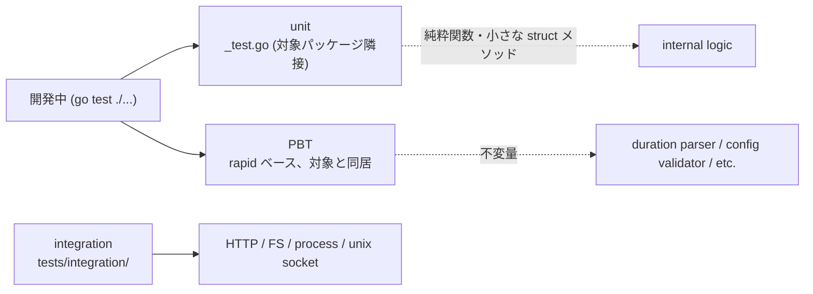

# Testing

mitsume のテスト方針。unit / PBT / integration の 3 階層をバグ検出のために書き、外部境界だけを mock し、テスト間で state を共有しない。

## テスト階層

3 階層を独立に走らせる。実装コードと 1:1 に近い unit を厚く、外部境界を跨ぐ経路を integration で貫通させ、純粋関数の不変量を PBT で網羅する。

| 階層 | 配置 | 目的 | 実行速度 |
|---|---|---|---|
| unit | 対象パッケージ隣接 `*_test.go` | 関数・型メソッドの入出力検証 | ミリ秒単位 |
| PBT | 対象パッケージ隣接 `*_property_test.go` | 純粋関数の不変量を rapid で網羅 | 秒単位 |
| integration | `tests/integration/` | 外部境界を跨ぐ経路 (HTTP / FS / process / unix socket) | 秒〜数十秒 |

test 名は `Test<対象>_<条件>_<期待結果>` の形で、読むだけで検証内容が分かるようにする。table-driven test は `t.Run(name, ...)` で subtests に分け、失敗時にどの入力かが即断できるようにする。

## TDD

失敗するテストを先に書き、それを通す最小実装を後から入れる順序を守る。docs/ の仕様更新 → テスト追加 → 実装、の順で 1 単位を進める。

- 通すためだけのテストを書かない。境界値 / エッジケース / 異常系のうち少なくとも 1 つを含めない test は追加しない
- 実装を書いた後にテストを合わせに行かない。実装が仕様に合っていない場合はテストではなく実装を直す
- refactor 中は「既存テストが全部 green」の状態を維持する。1 コミット内で赤を通過させない

## PBT (property-based testing)

Go の PBT は [`pgregory.net/rapid`](https://github.com/flyingmutant/rapid) を採用する。unit と同じ `go test` の runner で走らせ、watch 相当のループに乗せる。

- 「panic しない」「error にならない」は不変量として書かない。入出力の意味のある制約を書く
- generator は対象パッケージの `*_property_test.go` に定義し、複数 test で使い回す generator は `tests/internal/gen/` に集約する
- shrink で縮小された反例を debug の起点にする。反例は fixture として unit test にも落とし、regression の網を残す
- 実行時間が許すなら `rapid.Check` の `-rapid.checks` を default から増やして探索幅を稼ぐ

主な対象は `duration` parser / 設定 JSON validator / heartbeat file シリアライザ / Slack payload builder など、入出力が純粋な部分。

## mock 境界

mock してよいのは mitsume の外側にあるものだけ。内部関数 / 内部 struct / 内部 interface を mock した瞬間、テストは設計の鏡ではなくなる。

| 区分 | 対象 |
|---|---|
| mock する | HTTP client / server (`net/http/httptest`) |
| mock する | ファイルシステム (`t.TempDir()`) |
| mock する | 子プロセス (fake binary を `PATH` 越しに差し込む) |
| mock する | unix socket (`net.Listen("unix", ...)` のテスト用サーバー) |
| mock する | 時刻 (対象関数に `func() time.Time` を注入) |
| mock しない | 内部関数 / 内部 struct / 内部 interface |
| mock しない | `encoding/json` / `time.ParseDuration` 等の標準ライブラリ |
| mock しない | 設定 JSON schema / Go 型 |

内部の mock が必要に見えたら、テストではなく設計を直す。境界を明示するために interface を切る場合、その interface は本番コードで使われる形で切り、テスト専用の interface を増やさない。

## 状態共有と実行順序

テスト間で state を共有しない。並列実行・shuffle で全件 green を保つ。

- 一時ファイルは `t.TempDir()` を使い、テスト終了時に自動で片付ける
- 環境変数は `t.Setenv` を使う。手書きの `os.Setenv` + `defer os.Unsetenv` を書かない
- グローバル state (`sync.Once` 初期化のシングルトン等) を書かない。testable にするため関数引数か struct field で渡す
- `t.Parallel()` を積極的に使い、並列で通ることを既定にする
- test 間で fixture ファイルを書き換えて共有しない。fixture は read-only、mutation が必要なら `t.TempDir()` にコピーする
- `go test -shuffle=on` で並び順に依存しないことを確認する

## Mutation testing

Go 環境の mutation testing ツール選定に依存せず、次のテスト作法でテストの検出力を担保する。

- 境界値 (0 / 1 / 上限 / 上限 - 1 / 上限 + 1) を必ずテストに含める
- エッジケース (空文字列 / 空配列 / nil / 最小・最大 duration / タイムアウト直前) を明示的にテストする
- 異常系 (parse error / network error / timeout / permission denied / EOF) を必ず含める
- 「正常系だけ」「happy path だけ」の test file を許さない

## カバレッジについて

カバレッジは目標にしない。行カバレッジを上げるためだけのテストを書かない。

- `go test -cover` の数値を PR merge 基準に使わない
- 未 cover 行が残るのは、その行が仕様に無いか、境界外エラー処理で cover が難しいかのどちらか。前者なら消す、後者なら残す
- 仕様書 (`docs/`) の項目に対して、テストが対応しているかを人手で確認する

## 主要な cross-boundary テスト対象

外部境界を跨ぐ経路は最低限これだけカバーする。unit で内側を、integration で境界を跨ぐ経路を貫通させる。

- **HTTP checker のリクエスト / レスポンス**: `httptest.NewServer` で対象 endpoint を模し、status code / body / header の判定ロジック、timeout、redirect、TLS 検証失敗を検証する
- **Slack notify**: `httptest.NewServer` で Slack Incoming Webhook を模し、payload の JSON 形状、retry 挙動、非 2xx 応答時のエラー伝搬を検証する
- **heartbeat file の read / write**: `t.TempDir()` 配下で `last_ping_at` の write → read の round trip、atomic rename の並行性 (goroutine 複数から同時 write) を検証する
- **container checker の unix socket 直叩き**: `net.Listen("unix", ...)` でテスト用サーバーを立て、docker / podman の `/containers/<id>/json` 応答を模して `.State.Status == "running"` を判定するロジックを検証する
- **cmd checker**: fake external binary (`exec.Command` から起動する test helper binary、`go test` の `TestMain` 経由) を用意し、exit code 0 / 非 0、stdout / stderr の組合せ、timeout でのプロセス強制終了を検証する
- **duration parser**: `500ms` / `30s` / `5m` / `1h` / `24h` / `3d` の受理と、`w` (週) / ISO 8601 (`PT1H` 等) / 空文字列 / 不正表記の拒否を PBT + unit で検証する
- **設定 JSON パーサ**: 設定ファイル探索順 (`--config` > `$MITSUME_CONFIG` > `./mitsume.json`)、`_env` サフィックスによる env 展開、未定義 env 参照時のエラー、schema 違反時のエラーメッセージを検証する

